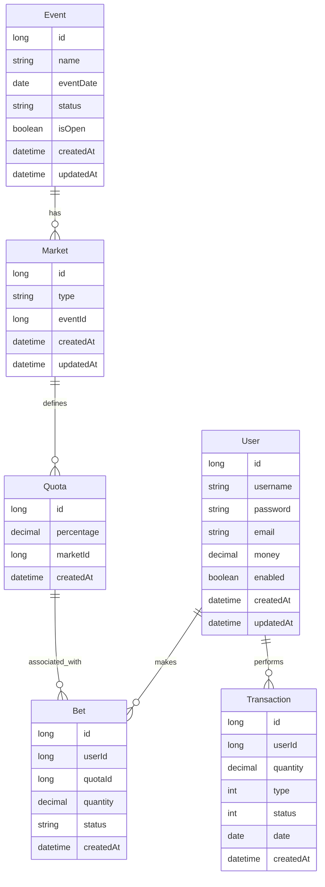

Hello bets is an alternative to 1xbet and similar platforms

This is my current database diagram



The first step is to build a functional monolith, conduct performance tests and scale.

## How to Run
To get started with the project, use the following commands:
```sh
make build   # Build the application
make up      # Start the application
```

## Types of transactions
- [ ] Deposit
- [ ] Transfer For Accounts
- [ ] Withdraw
- [ ] Bet
- [ ] Cancel Bet


## TODO
- [ ] Implement all database tables (`ALL_TABLES`)
- [ ] Add rate limiting to API endpoints (`RATE_LIMITER`)
- [ ] Enforce password attempt limits (`PASSWORD_TRY_LIMIT`)
- [ ] Add controller-level input validations (`CONTROLLER_VALIDATIONS`)
- [ ] Validate `iss` and `aud` claims in JWTs (`ISS_AUD_VALIDATION_TO_JWT`)
- [ ] Standardize and improve generic error responses (`GENERIC_ERRORS_RETURN`)
