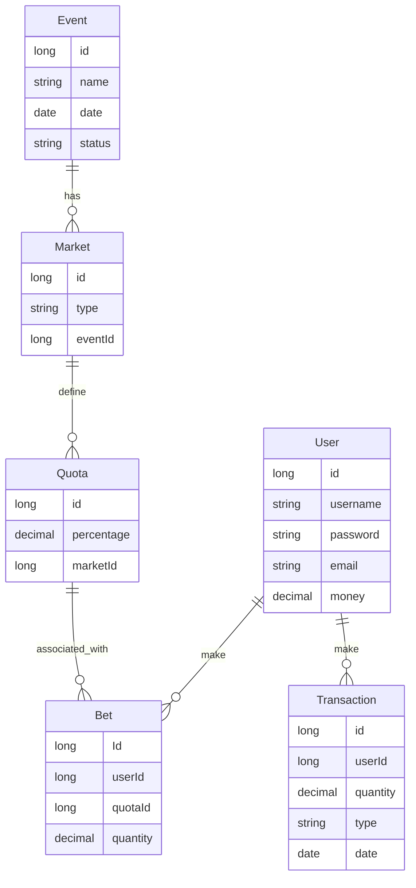

Hello bets is an alternative to 1xbet and similar platforms

This is my current database diagram

```mermaid
erDiagram
    User{
        long id
        string username
        string password
        string email
        decimal money  
    }

    Bet{
        long Id
        long userId
        long quotaId
        decimal quantity
    }

    Quota{
        long id
        decimal percentage
        long marketId
    }

    Event{
        long id
        string name
        date date
        string status
    }

    Market{
        long id
        string type
        long eventId
    }  

    Transaction{
        long id
        long userId
        decimal quantity
        string type
        date date
    }

    User ||--o{ Bet : make
    Event ||--o{ Market : has
    Market ||--o{ Quota : define
    Quota ||--o{ Bet : associated_with
    User ||--o{ Transaction : make


```

The first step is to build a functional monolith, conduct performance tests and scale.
